  <strong>on-oh-tow-tah</strong>

  
  
  

I'm a Computer Science student focused on building full-stack and backend software. I work primarily with Java, Spring Boot, TypeScript, React, SQL, Docker, AWS, and cloud technologies.

I've built and deployed a full-stack financial tracking application and a social platform API for developers. I enjoy taking ideas from concept to working products that people can actually use.

Outside of development, I work full-time at Xfinity, where I rank among the top 10% of sales representatives company-wide. I've also served as Student Government Association President and contributed to a NASA Lunabotics software team using C++ and ROS2.

## Tech Stack

**Languages**

**Frameworks & Libraries**

**Databases**

**Tools & Platforms**

**Testing, APIs & Architecture**

## Experience & Leadership

- **Retail Sales Consultant, Xfinity** — Rank among the top 10% of sales representatives company-wide while delivering friendly, personalized technology solutions.
- **President, Student Government Association** — Led 20+ student organizations, helped oversee a $933,000 student activity budget, and authored an SGA guidebook.
- **Software Team, NASA Lunabotics** — Contributed to robotics software using C++ and ROS2.

## What I'm Working Toward

- Building a better version of my spending tracker or trying to learn from the mistakes of it really
- Deepening my knowledge of system design, distributed systems, cloud infrastructure, and testing
- Pursuing 2027 Software Engineering internships across backend, full-stack, cloud, platform, infrastructure, and developer tools

## GitHub Stats

  

  
  
  

